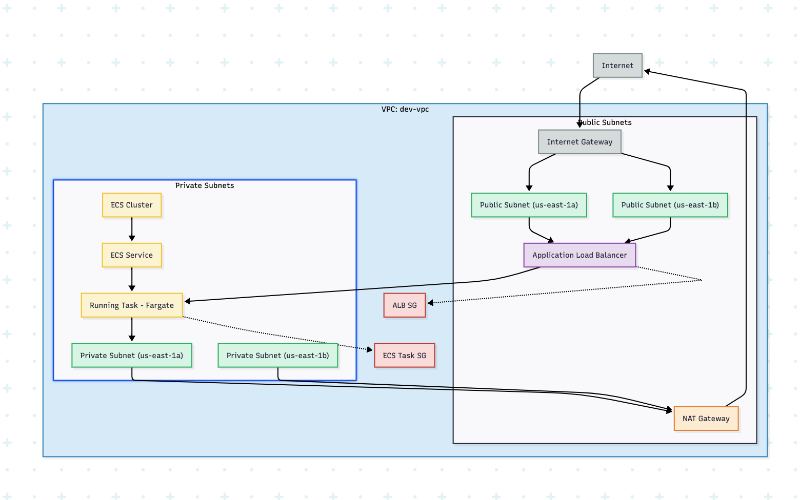
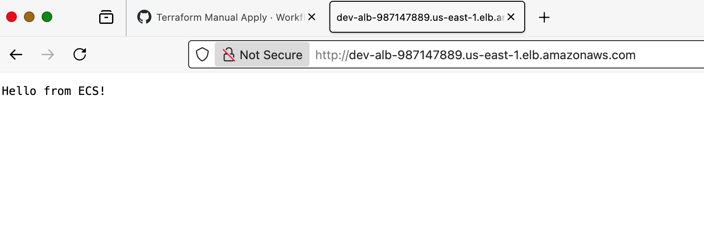

# Take-Home Assessment — AWS ECS Microservice with Terraform & CI/CD

**Overview**

This repository contains a Terraform-based AWS infrastructure setup for a sample ECS microservice. The design demonstrates production-style practices while keeping **cost and complexity optimized for development environments**.

Key goals:
- Service securely accessible to customers over the internet.  
- Internal components remain private.  
- Infrastructure is **reproducible and automated** with Terraform.  
- CI/CD workflows validate and deploy infrastructure changes using **GitHub Actions**.

---

## **Network & Architecture Diagram**

Here’s the high-level network and service architecture for the microservice:


**Description:**

- **Public Subnets:** Hosts ALB for internet-facing traffic.  
- **Private Subnets:** Hosts ECS tasks and (optionally) RDS.  
- **NAT Gateways:** Allow private subnets to access the internet for updates.  
- **Security Groups:** Enforce least privilege; ALB is public, ECS/RDS private.  
- **Bastion:** SSM-only, no public IP, private management access.  

> Diagram illustrates a multi-AZ deployment with private/public subnet separation, security boundaries.

---

## **Compute, Networking & Security Decisions**

**Compute Choice — ECS vs EKS:**  
- ECS (Fargate) was chosen for container orchestration.  
  - Serverless container execution reduces operational overhead.  
  - Scales automatically with demand.  
  - Easily integrates with ALB for load balancing.  
  - Public container image (hashicorp/http-echo:0.2.3) used to simplify deployment and focus on Terraform and infrastructure design.  
- **Why not EKS:**  
  - While EKS is a strong production-grade choice, I treated this assessment as a **real-world MVP project** with a 4-day timeline.  
  - ECS allows faster validation of infrastructure and a working service, letting me focus on Terraform, networking, CI/CD, and security without the operational overhead of Kubernetes.  
- In production, application images would be built via CI/CD and pushed to a private ECR repository with **versioned tags** for immutability and security.  

**Proof of Deployment:**  
- To validate the ECS service, I included a **screenshot of the “Hello from ECS” page** in my browser.  
- This demonstrates the infrastructure is **functional end-to-end**, including ALB, ECS tasks, and networking.  
 

**Networking Design:**  
- **VPC Module:** Creates VPC, public and private subnets, route tables, NAT gateways, and the S3 gateway endpoint.  
- **VPCE Module:** Created separately for interface endpoints (ECR API, ECR DKR, etc.) to avoid circular dependencies.  
  - Inputs: `private_subnet_ids`, `private_route_table_ids`, `vpce_sg_id` from the Security Groups module.  
  - **Status:** Module included to demonstrate production-style design, but currently not in use because the microservice is accessed via a public ALB.  
- Multi-AZ deployment ensures high availability. 

**Security Design:**  
- **ALB:** Public-facing for customer access; HTTP(S) traffic allowed from the internet (required for testing).  
- **ECS & RDS (private):** No public access.  
- **SSM-only Bastion:** Private management access, no SSH, no public IP.  
  - Benefits: Least privilege, fully auditable via CloudTrail, no SSH key management.  
- **IAM:**  
  - Terraform execution user is created outside Terraform (bootstrap) to avoid circular dependencies.  
  - Scoped IAM privileges granted (CreateRole/AttachPolicy/PassRole limited to `microservice-*` resources) for ECS execution/task roles.  
  - In production, IAM roles would typically be provisioned by a dedicated platform/security team and consumed via input variables.  

> **Commented modules:**  
> - **RDS:** Included as a module for multi-AZ production-style databases but commented out to reduce cost in dev environment.  
> - **VPCE:** Included to demonstrate private endpoints for services like ECR but not currently used.  
> - **ECR:** Module exists for production-style private image storage but simplified here by using public images.  
> These are to show a production-grade design while keeping deployment affordable and simple for development.

---

## **Terraform CI/CD Workflows**

**1. PR Validation & Automatic Plan (dev only)**  
- Triggered on pull requests or commits to `main`.  
- Steps:  
  - Checkout and setup Terraform.  
  - **Format & Validate:** `terraform fmt`, `terraform validate`, `tflint`.  
  - **Static security scans:** `tfsec` (critical only), `Checkov`.  
  - Generate Terraform plan for dev.  
  - Upload `tfsec-report.txt` and `checkov-report.txt` as artifacts.  

- **Reason for `|| true` in workflows:**  
  Some security findings are acceptable for dev/test environments (e.g., public ALB, open egress rules). Reports are captured as artifacts for review instead of failing the pipeline.  

**2. Manual Plan**  
- Triggered via GitHub Actions "Run workflow" button.  
- Select dev or prod environment for planning changes before applying.  

**3. Manual Apply**  
- Triggered manually; requires reviewer approval for prod environments via GitHub Environment protections.  
- Applies Terraform changes using environment-specific variables.  
  

> **Environment-specific secrets:**  
> - AWS credentials are separated per environment using GitHub Environments.  
> - Ensures dev cannot modify prod resources, and only authorized users can deploy production infrastructure.  

---

### **Manual Deployment Instructions**

**1. Clone the repository**  
Clone the repository and navigate into the project directory.  
Example:  

```bash
git clone git@github.com:TejasriBompada/ecs-fargate-microservice-infra.git  
cd ecs-fargate-microservice-infra 
``` 

**2. Run Terraform using the helper script (tf.sh)**  
The tf.sh wrapper makes Terraform commands much easier and safer by:  
- Automatically selecting the correct backend config and variable files.  
- Defaulting to **dev** if TF_ENV is not set.  
- Reducing human error when switching between environments.  

Examples:  
- **Plan changes:** `TF_ENV=dev ./tf.sh plan -out=tfplan`  
- **Apply changes:** `TF_ENV=dev ./tf.sh apply` 

**3. Why manual deployments are enabled**  
- **Dev flexibility:** Developers can run quick tests in dev without waiting for a pipeline.  

## **Cost & Development Considerations**

- **ECS Fargate over EC2/EKS:** Pay only for container runtime, no always-on EC2 nodes.  
- **Right-sizing ECS tasks:** Dev uses smaller task sizes to reduce cost, while prod can scale up as needed.  
- **NAT Gateways minimized:** Only one NAT Gateway in dev (instead of per-AZ) to cut hourly costs.  
- **RDS commented out in dev:** High-cost database service is provisioned only when required for production.  
- **VPC Endpoints (VPCE) optional:** Designed for production privacy, but skipped in dev to avoid hourly charges.  
- **SSM-only bastion EC2:** A single small EC2 instance is used as a bastion, but with SSM-only authentication (no SSH keys, no Elastic IP). This keeps cost low while still allowing secure access to private subnets. 
- **Parameterized attributes:** All resource sizes and counts are parameterized, enabling small/cheap dev deployments and larger prod-ready ones.  
- **Shared modules across environments:** Reduces maintenance effort and prevents costly misconfigurations by reusing the same infrastructure patterns across dev and prod.  

This balances **production-grade architecture** with **lean, cost-effective development environments**.


## **Future Improvements / Production Enhancements**

- **Private ECR Integration:** Build and push application images via CI/CD with versioned tags for immutability and security.  
- **HTTPS via ACM:** Enable ACM certificates on the ALB for secure internet-facing traffic.  
- **RDS Module Activation:** Deploy a multi-AZ RDS instance in private subnets for production database workloads.  
- **VPCE Usage:** Use interface endpoints for services like ECR, SSM, and S3 to maintain fully private traffic and reduce costs.  
- **Pipeline Security Enforcement:** Configure CI/CD pipelines to fail on high-severity tfsec/Checkov findings to reduce alert fatigue while enforcing security best practices.  
- **IAM Role Management:** In production, use dedicated platform/security team-managed roles instead of creating roles dynamically in Terraform.  
- **Cost Optimizations:** Add environment-specific scaling policies and dev environment discounts (e.g., smaller ECS tasks, reduced database storage) while maintaining production readiness.

---

## **Tools & References**

**Tools Used:**  
- Terraform — Infrastructure as Code  
- GitHub Actions — CI/CD workflows  
- tflint — Terraform code linting  
- tfsec — Static security scanning for Terraform  
- Checkov — Additional static analysis and security scanning  
- AWS SSM — Private bastion management without SSH  

**Notes:**  
- Some modules (VPCE, RDS, ECR) are included to demonstrate production-style design but may not be fully utilized in this assessment.  
- Choices such as using public container images, disabling ACM certificates, and dev-friendly defaults are intentional to reduce cost and simplify demonstration.  
- Terraform execution user is created externally (bootstrap) to avoid circular dependencies; Terraform manages all subsequent infrastructure.  

> This README documents the design rationale, CI/CD workflows, security, and cost considerations to provide a complete view of the infrastructure setup.

## **AI Usage & Productivity Tools**

During this assessment, AI was used as an **assistance tool** to improve productivity and code quality. All **design decisions, architecture choices, and security considerations were made by me**. AI helped with routine tasks such as:

- Creating Terraform module templates and starter code  
- Ensuring consistent formatting, syntax, and comments across multiple files.  
- Cleaning up repetitive sections and improving readability of Terraform configurations.  

In addition to AI:  

- **Amazon Q** was used to generate a list of AWS resources to include in the architecture diagram.  
- **Mermaid** was used to create the network and architecture diagram for visual documentation.  

> **Key point:** All infrastructure design choices — including module separation (VPC, VPCE), private/public subnet layout, bastion design, CI/CD workflow structure, and security policies — were determined by me. AI and supporting tools were leveraged strictly to assist with coding efficiency, diagram preparation, and documentation clarity.